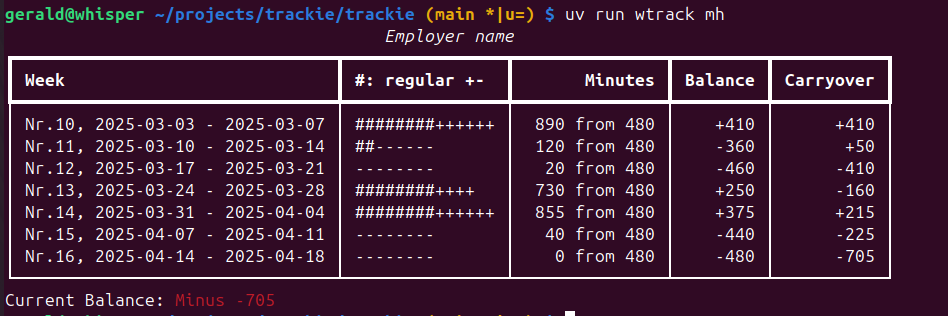

# Trackie

Track your working time with [vim-outliner](https://github.com/vimoutliner/vimoutliner) or just a plain file
as backend and write-frontend.
Using [rich](https://github.com/Textualize/rich) tables as read-frontend or export data to CSV file.

Your tracked file where you note your work must use this schema:

```text
YYYY-MM-DD
<- tab ->work description
<- tab -><- tab ->duration
YYYY-MM-DD
<- tab ->work description
<- tab -><- tab ->duration
<- tab ->work description
<- tab ->that spans on another line
<- tab -><- tab ->duration
...
```
where

    - the date is at the beginning of a line
    - the work description is indented by one tab
    - the description may span multiple lines all indented by one tab
    - the duration is indented by two tabs
    - the duration is an integer representing worked time in minutes

Output:



trackie reads its config from a `.trackie.toml` in users home directory:

```toml
minutes_per_week = 480
minutes_per_day = 96
start_date = YYYY-MM-DD

[clients]
employer = "/path/to/foo.otl"

[abbr]
em = "employer name" # save keystrokes
```

Install
-------
```bash
uv tool install trackie@git+https://git@github.com/gradel/trackie
```
Then create `~/.trackie.toml` file and edit it. Mandatory fields are

- minutes_per_week when aggrgating over weeks
- minutes_per_day when aggregating over days
- a client in the clients table which value is the path to your work tracking file

Usage
-----
```bash
wtrack --help
```
