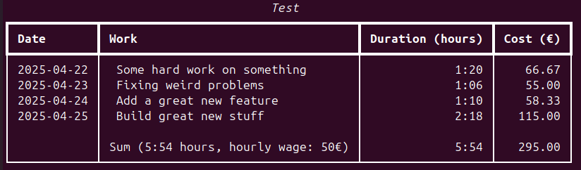

# Trackie

Track your working time with [vim-outliner](https://github.com/vimoutliner/vimoutliner) or just a plain file
as backend and write-frontend.
Using [rich](https://github.com/Textualize/rich) tables as read-frontend or export data to CSV file.

Your tracked file where you note your work must use this schema
(Note: tabs may be spaces, see config):
```text
YYYY-MM-DD
<- tab ->work description
<- tab -><- tab ->duration
YYYY-MM-DD
<- tab ->work description
<- tab -><- tab ->duration
<- tab ->work description that
<- tab ->spans on another line
<- tab -><- tab ->duration
...
```
where

    - the date is at the beginning of a line
    - the work description is indented by one tab
    - the description may span multiple lines all indented by one tab
    - the duration is indented by two tabs
    - the duration is an integer representing worked time in minutes

Output of list mode:



Output of aggregate mode:


Install
-------
```bash
uv tool install trackie@git+https://git@github.com/gradel/trackie
```
Then create `~/.trackie.toml` file and edit it.

Configuration
-------------

trackie reads its config from a `.trackie.toml` in users home directory:

```toml
minutes_per_week = 480
minutes_per_day = 96
start_date = YYYY-MM-DD
spaces = 4 # Only when using spaces for tabs!
mode = "aggregate"  # default is "list"
interval = "day"  # default is "week"

[clients]
my-employer = "/path/to/my-employer.otl"

[default]
client = "my-employer"

[abbr]
me = "my-employer" # save keystrokes

[hourly-wages]
my-employer = 50
```
Mandatory field is

- at least one entry in the clients table whose value is the path to a work tracking file

Optional fields are:

- mode - `list` or `aggregate`, default: `list`
- interval - when mode is aggregate, `day` or `week`, defaults to `week`
- minutes_per_week - when aggrgating over weeks
- minutes_per_day - when aggregating over days
- start_date - if not set and the option `start` is not given when
running the command the first day of the current month is used
- currency_sign - default "€"
- display_hours - display durations in hours (HH:MM), default is true. When false displays in minutes
- spaces - if you want to use spaces for tabs set this to the number of spaces you will insert for one tab
- table "default" with key "client" - will be used when omitting `client` argument for the command.
Note: if there is only one entry in the clients table this client is then
used anyway when no client is given on the command line.
- table hourly-wages - when using list mode
- table "abbr" - for using short values to give as `client` argument to the cli command.

Update
------
```bash
uv tool upgrade trackie@git+ssh://git@github.com/gradel/trackie
```
Usage
-----
```bash
wtrack --help
```

